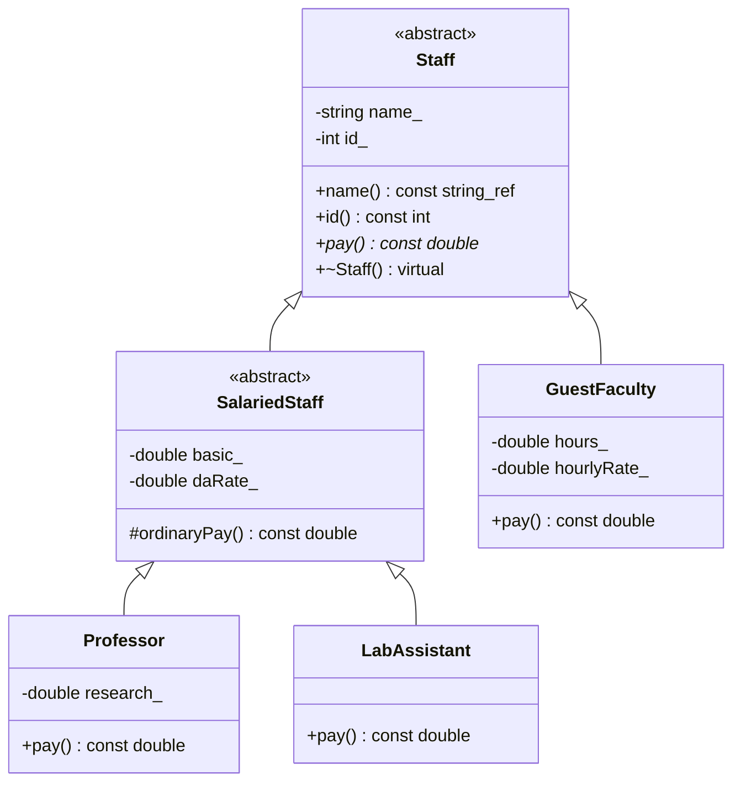

# Payroll UML

```mermaid
classDiagram
class Staff {
  <<abstract>>
  -string name_
  -int id_
  +name() const string_ref
  +id() const int
  +pay() const double*
  +~Staff() virtual
}
class SalariedStaff {
  <<abstract>>
  -double basic_
  -double daRate_
  #ordinaryPay() const double
}
class Professor {
  -double research_
  +pay() const double
}
class LabAssistant {
  +pay() const double
}
class GuestFaculty {
  -double hours_
  -double hourlyRate_
  +pay() const double
}
Staff <|-- SalariedStaff
SalariedStaff <|-- Professor
SalariedStaff <|-- LabAssistant
Staff <|-- GuestFaculty
```

Public inheritance means is-a; private data protects invariants. The protected helper shares the DA rule. Asterisk on pay denotes an abstract operation in Mermaid UML notation.
